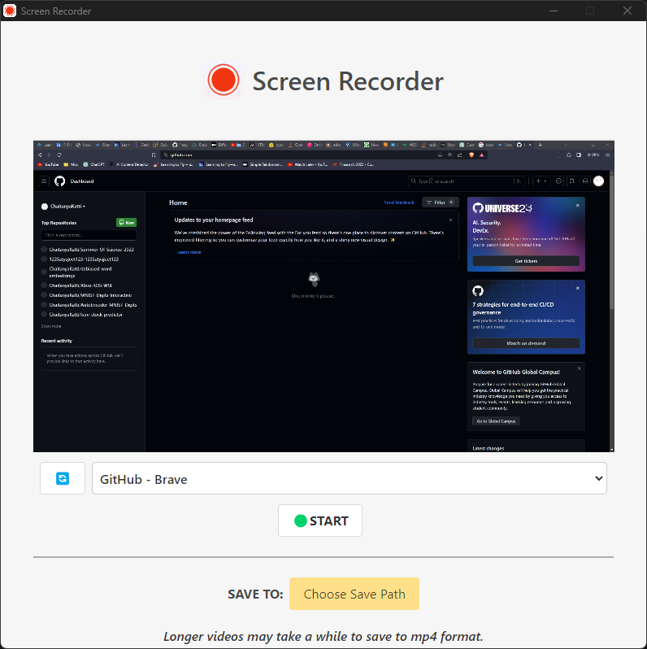

# Electron Screen Recorder App 🎥

This Electron app allows you to record your screen, inspired by the [Fireship🔥Youtube Video](https://www.youtube.com/watch?v=3yqDxhR2XxE). The application uses a newer version of Electron and features changes in how the renderer and main processes communicate with each other using `ipcRenderer` and `ipcMain`.

<div align="center">
    
</div>


## How to Run ▶️

```bash
# Clone this repository
git clone https://github.com/chaitanyakatti/electron-screen-recorder.git

# Navigate to the repository

cd electron-screen-recorder

# Install dependencies
npm install

# Run the app
npm start
```

# How to Package 📦
```bash
# Package for Windows
npm run package-win

# Package for macOS
npm run package-mac

# Package for Linux
npm run package-linux
```

# License
This project is licensed under the MIT License.